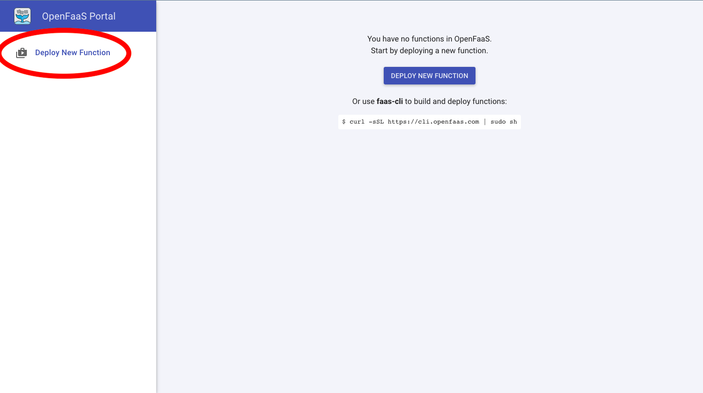
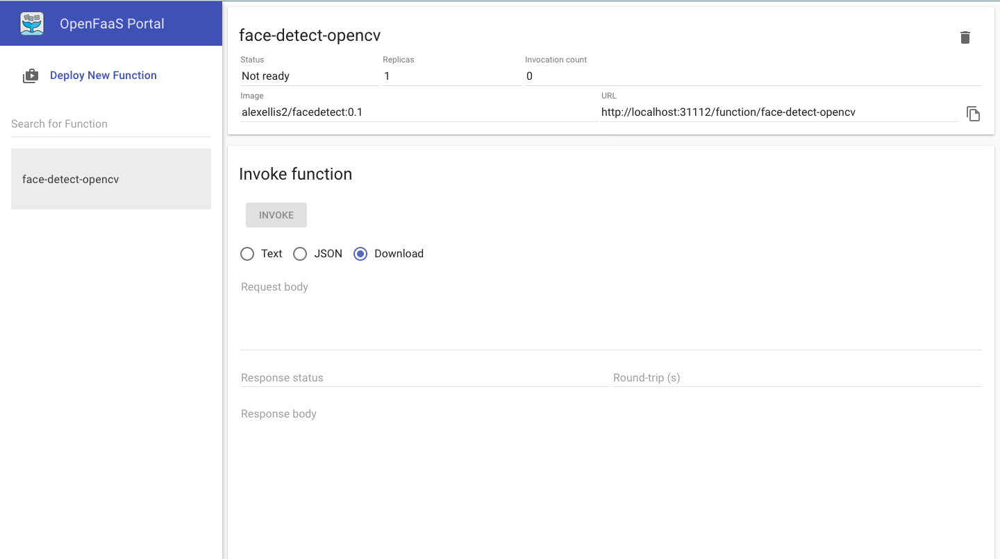

# Working with functions

You can get a local environment ready using Vagrant for an automatically setting up a machine on Virtualbox.
To download Vagrant follow this link where you can find the complete list based on Os System:

* [https://www.vagrantup.com/downloads.html](https://www.vagrantup.com/downloads.html)

## Vagrant installation - Windows

Download the following file and install it:

* [https://releases.hashicorp.com/vagrant/2.2.5/vagrant_2.2.5_x86_64.msi](https://releases.hashicorp.com/vagrant/2.2.5/vagrant_2.2.5_x86_64.msi)

## Vagrant installation - Linux

Download the package and extract it just pasting the following commands:

```bash
wget https://releases.hashicorp.com/vagrant/2.2.5/vagrant_2.2.5_linux_amd64.zip
unzip vagrant_2.2.5_linux_amd64.zip
```

You can also use [Homebrew](https://docs.brew.sh/Homebrew-on-Linux) like this:

```bash
brew cask install vagrant
```

If you prefer, you can use your favorite package manager. For example, in Ubuntu
you can type:

```bash
sudo apt install virtualbox vagrant
```

## Vagrant installation - MacOS

Download the dmg file and install it:

* [https://releases.hashicorp.com/vagrant/2.2.5/vagrant_2.2.5_x86_64.dmg](https://releases.hashicorp.com/vagrant/2.2.5/vagrant_2.2.5_x86_64.dmg)

If you have [Homebrew](https://brew.sh/) installed just type this in the command line:

```bash
brew cask install vagrant
```

## Install SOSC2019 Vagrant project

To be operative with the current project you have to download with [git](https://git-scm.com/downloads) or
extract the [zip file](https://github.com/Cloud-PG/SOSC2019/archive/master.zip).

Open your command line and paste the following commands:

```bash
git clone https://github.com/Cloud-PG/SOSC2019.git
cd SOSC2019
```

Now set up the vagrant environment using the following command:
```bash
./vagrant up
# Or if you have vagrant executable in your PATH
vagrant up
```
> **NOTE**: This may take few minutes, depending on network and your computer performance

And then, log into the created machine:

```bash
./vagrant ssh
# Or if you have vagrant executable in your PATH
vagrant ssh
```

> **NOTE**: Vagrant and Virtualbox are required on the machine of course. If you don't have them
> check the previous steps to install the packages

Some additional machines have been prepared for the school participants. You can find hot to access to your machine [here](https://raw.githubusercontent.com/Cloud-PG/SOSC2019/master/ansible/hosts)

## Using example functions and the OpenFaaS UI

Now you can go to <a href="http://localhost:31112/ui/" target="_blank">http://localhost:31112/ui/</a> and, using the password in gateway_password.txt with user `admin`, you should be able to log in. To see your password just type:

```bash
cat gateway-password.txt
```

You will have a page like that as result after the login:


Let's start playing with some example functions. For instance, you can instantiate a function the face-detection of an online image just clicking on `Deploy new function`, searching for `opencv` and installing `face-detect with OpenCV` (button `Deploy`).



---


Now a new tab should appear with the function name selected. 



From there you can check the status and also try to invoke the function from the UI.
For instance, as soon as the status of the function is ready, let's try to put an url with a jpg image in the request body field and then press invoke.

Let's try the two below for example:

```text
https://parismatch.be/app/uploads/2018/04/Macaca_nigra_self-portrait_large-e1524567086123-1100x715.jpg
http://thedreamwithinpictures.com/wp-content/uploads/2013/05/c3a89__montage_2048-copy.jpg
```

For the second one you will have the following result:


---


The list of all available functions in the store is also available from CLI using the following command from the vagrant machine already created:

```bash
faas-cli store list
```

## Deployment of a Python function (from [OpenFaaS workshop](https://github.com/openfaas/workshop/blob/master/lab3.md#example-function-astronaut-finder))

Do everyone have a docker account?

```bash
mkdir astronaut-finder
cd astronaut-finder

faas-cli new --lang python3 astronaut-finder --prefix="<your-docker-username-here>"
```

### Function fundamentals

The previous command will write three files for us:

```./astronaut-finder/handler.py```

This is the handler for the function. 
> **NOTE**: an handler get a request object with the raw request and can print the result of the function to the console.

```./astronaut-finder/requirements.txt```

Use this file to list any pip modules you want to install so, to manage your Python requirements, such as requests or urllib

```./astronaut-finder.yml```
This file is used to manage the function:
> **NOTE**: it has the name of the function, the Docker image and any other customizations needed.

Edit `./astronaut-finder/requirements.txt` and add the following dependency:

```
requests
```

### Write the function's code

We'll be pulling in data from [http://api.open-notify.org/astros.json](http://api.open-notify.org/astros.json)

Here's an example of the result we will have from that url:

```json
{
  "number": 6,
  "people": [
    {
      "craft": "ISS",
      "name": "Alexander Misurkin"
    },
    {
      "craft": "ISS",
      "name": "Mark Vande Hei"
    },
    {
      "craft": "ISS",
      "name": "Joe Acaba"
    },
    {
      "craft": "ISS",
      "name": "Anton Shkaplerov"
    },
    {
      "craft": "ISS",
      "name": "Scott Tingle"
    },
    {
      "craft": "ISS",
      "name": "Norishige Kanai"
    }
  ],
  "message": "success"
}
```

Let's write an handler that gets for us that result. You have to edit `handler.py`:

```python
import requests
import random

def handle(req):
    r = requests.get("http://api.open-notify.org/astros.json")
    result = r.json()
    index = random.randint(0, result["number"]-1)
    name = result["people"][index]["name"]

    return "%s is in space" % (name)
```


### Deploy the function

First, build it:

```bash
faas-cli build -f ./astronaut-finder.yml
```

Push the function:

```bash
docker login
faas-cli push -f ./astronaut-finder.yml
```

Deploy the function:

```bash
export OPENFAAS_URL=http://127.0.0.1:31112
cat  $HOME/gateway-password.txt | faas-cli login --password-stdin
faas-cli deploy -f ./astronaut-finder.yml
```

And now, just wait a bit for the function to be in `Ready` state. Check from cli with
the following command:

```bash
faas-cli describe astronaut-finder | grep Status
```

You will have a result like this if everythings is up and running:
```text
Status:              Ready
```

and then try to invoke it from command line:

```bash
echo | faas-cli invoke astronaut-finder
```

You will receive this as response a random name of a docker user, like this:

```text
Anton Shkaplerov is in space
```

You can also use the http endpoint:

```bash
curl http://localhost:31112/function/astronaut-finder
```

Or try it from the dashboard, just clicking to `invoke` and see the result in `response body`:


## Homework

1. Try to create a function for serving your ML model (you can also make use of: [https://github.com/alexellis/tensorflow-serving-openfaas](https://github.com/alexellis/tensorflow-serving-openfaas) )
2. Create a function in a different language if you know any
