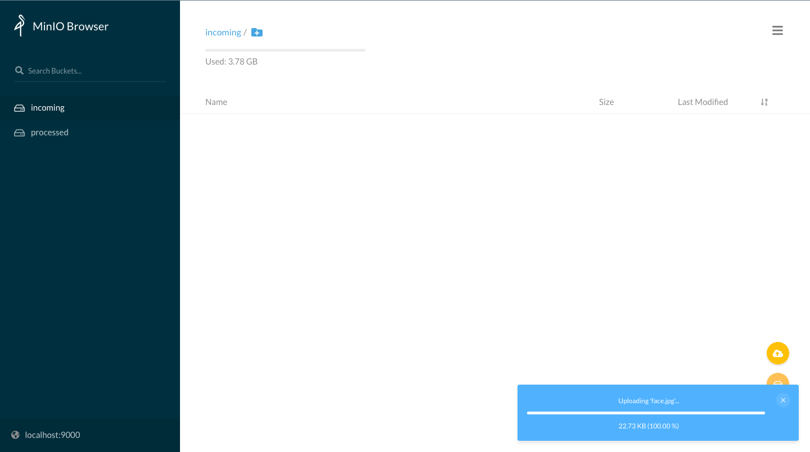

# Workflows - a.k.a. functions calling functions
## Building your first workflow - from [OpenFaaS workshop](https://github.com/openfaas/workshop/blob/master/lab4.md#kubernetes-1)

Using the CLI to deploy SentimentAnalysis function from the store:

```bash
mkdir $HOME/workflows
cd $HOME/workflows
export OPENFAAS_URL=http://127.0.0.1:31112
faas-cli store deploy SentimentAnalysis
```

The Sentiment Analysis function will tell you the subjectivity and polarity (positivity rating) of any sentence. The result of the function is formatted in JSON as you can see with the example below:

```bash
echo -n "California is great, it's always sunny there." | faas-cli invoke sentimentanalysis
```

```json
# Formatted result
{
  "polarity": 0.8,
  "sentence_count": 1,
  "subjectivity": 0.75
}
```

Now let's create a new simple function (like in the previous exercise) that will call `sentimentanalysis` just forwarding the request text.

```bash
faas-cli new --lang python3 invoker --prefix="<your-docker-username-here>"
```

The `handler.py` code should look like this:

```python
import os
import requests
import sys

def handle(req):
    """handle a request to the function
    Args:
        req (str): request body
    """

    gateway_hostname = os.getenv("gateway_hostname", "gateway")

    test_sentence = req

    r = requests.get("http://" + gateway_hostname + ":8080/function/sentimentanalysis", data=test_sentence)

    if r.status_code != 200:
        sys.exit("Error with sentimentanalysis, expected: %d, got: %d\n" % (200, r.status_code))

    result = r.json()
    if result["polarity"] > 0.45:
        return "That was probably positive"
    else:
        return "That was neutral or negative"
```

Put `requests` in requirements.txt file:

```text
echo "requests" >> invoker/requirements.txt
```

Remember to set the environment variable `gateway_hostname` in `invoker.yml`:

```yaml
version: 1.0
provider:
  name: openfaas
  gateway: http://127.0.0.1:31112
functions:
  invoker:
    lang: python3
    handler: ./invoker
    image: mircot/invoker:latest
    environment:
      gateway_hostname: "gateway.openfaas"
```

Then, just deploy our function:

```bash
faas-cli up -f invoker.yml
```

You can now try to invoke the new function.
You can verify that the request has been forwarded to `sentimentanalysis` by your custom function. 
We have just created a basic workflow.

```bash
$ echo -n "California is bad, it's always rainy there." | faas-cli invoke invoker
That was neutral or negative
```

```bash
$ echo -n "California is great, it's always sunny there." | faas-cli invoke invoker
That was probably positive
```

## Triggers

### Example: using storage events webhook

If you are using Vagrant image you can start from here, otherwise at the end you'll find how to setup a S3 object storage on your own.

Let's configure it properly for using a webhook that points to our openfaas instance (we will use it later to trigger a function as soon as a new file appears).

```bash
mc admin config set local < /home/vagrant/config_minio.json
mc admin service restart local
```

The request sent to the function by Minio in case of a file upload will have a body in this form:

```json
{
  "EventName": "s3:ObjectCreated:Put",
  "Key": "images/test7.jpg",
  "Records": [
    {
      "eventVersion": "2.0",
      "eventSource": "minio:s3",
      "awsRegion": "",
      "eventTime": "2019-09-10T14:27:46Z",
      "eventName": "s3:ObjectCreated:Put",
      "userIdentity": {
        "principalId": "usernameID"
      },
      "requestParameters": {
        "accessKey": "myaccesskey",
        "region": "",
        "sourceIPAddress": "192.168.0.213"
      },
      "responseElements": {
        "content-length": "0",
        "x-amz-request-id": "15C319FC231726B5",
        "x-minio-deployment-id": "f6a78fdc-8d8e-4d2c-8aca-4b0bd4082129",
        "x-minio-origin-endpoint": "http://192.168.0.213:9000"
      },
      "s3": {
        "s3SchemaVersion": "1.0",
        "configurationId": "Config",
        "bucket": {
          "name": "images",
          "ownerIdentity": {
            "principalId": "usernameID"
          },
          "arn": "arn:aws:s3:::images"
        },
        "object": {
          "key": "test7.jpg",
          "size": 1767621,
          "eTag": "1f9ae70259a36b5c1b5692f91386bb75-1",
          "contentType": "image/jpeg",
          "userMetadata": {
            "content-type": "image/jpeg"
          },
          "versionId": "1",
          "sequencer": "15C319FC2679B7CB"
        }
      },
      "source": {
        "host": "192.168.0.213",
        "port": "",
        "userAgent": "MinIO (linux; amd64) minio-go/v6.0.32 mc/2019-09-05T23:43:50Z"
      }
    }
  ]
}
```

Now create two buckets called `incoming` and `processed`:

```bash
mc mb local/incoming
mc mb local/processed
```

Set the trigger for any new jpg file appearing in local/incoming:

```bash
mc event add local/incoming arn:minio:sqs::1:webhook --event put --suffix .jpg
```

You can log into the WebUI at <a href="http://localhost:9000/ui/" target="_blank">http://localhost:9000/ui/</a> with username `admin` and password `adminminio`.


From there you can upload files and check the contents of the buckets.


### Trigger a facedetect function on loaded images

First of all create a new function:

```bash
mkdir $HOME/triggers
cd $HOME/triggers

faas-cli new --lang python3 processimage --prefix="<your-docker-username-here>"
```

Then we need to modify the handler to:

1. get the file name from the storage event
2. get the file from the storage
3. encode it in base64 (required as input by the face detection function)
4. call the face detection function
5. get the output and save it back to the storage in a separate bucket

A possible result could be:

```python
import json
from minio import Minio
import requests
import os
import base64

def handle(st):
    """handle a request to the function
    Args:
        st (str): request body
    """

    # Decode the json from the Minio event
    req = json.loads(st)

    # Get configuration parameters from the docker environment (set in the processimage.yml)
    gateway = os.getenv("openfaas_gw", "gateway.openfaas")

    # Configure the storage client
    mc = Minio(os.environ['minio_hostname'],
                  access_key=os.environ['minio_access_key'],
                  secret_key=os.environ['minio_secret_key'],
                  secure=False)

    # Set the name for the source and destination buckets 
    source_bucket = "incoming"
    dest_bucket = "processed"

    # Get the name of the file from the 'Key' field in the event message
    file_name = req['Key'].split('/')[-1]

    # Get the file from the storage
    mc.fget_object(source_bucket, file_name, "/tmp/" + file_name)

    # Encode the image into base64
    f = open("/tmp/" + file_name, "rb")
    input_image = base64.b64encode(f.read())

    # Pass it to the facedetect function
    r = requests.post(gateway + "/function/facedetect", input_image)
    if r.status_code != 200:
        return "Error during call to facedetect, expected: %d, got: %d\n" % (200, r.status_code)

    # Finally get the output and save it locally
    dest_file_name = f"processed_{file_name}"
    f = open("/tmp/" + dest_file_name, "wb")
    f.write(r.content)
    f.close()

    f = open("/tmp/input_" + file_name, "wb")
    f.write(input_image)
    f.close()

    # sync to Minio
    mc.fput_object(dest_bucket, dest_file_name, "/tmp/"+dest_file_name)

    return f"Image {file_name} processed. Result is in {dest_bucket}"
```

Now you need to configure the deployment of the functions:

```yaml
version: 1.0
provider:
  name: openfaas
  gateway: http://127.0.0.1:31112
functions:
  # function for loading the image from storage - the code just edited
  processimage:
    lang: python3
    handler: ./processimage
    image: <your-docker-username-here>/processimage:latest
    environment:
      write_debug: true
      # environment variables used inside the funcion code
      minio_hostname: "10.42.0.1:9000"
      minio_access_key: "admin"
      minio_secret_key: "adminminio"
      openfaas_gw: "http://gateway.openfaas:8080"
 
  # face detection function, pre-built. You can find the source here: 
  # https://github.com/alexellis/facedetect-openfaas
  facedetect:
    skip_build: true
    image: alexellis2/facedetect:0.1
    environment:
      output_mode: "image"
      write_debug: true
```

Before pushing the function in, don't forget to set the requirements.txt:

```text
minio
requests
```

Then just build and deploy our two functions with:

```bash
faas-cli build -f processimage.yml
faas-cli push -f processimage.yml
faas-cli deploy -f processimage.yml
```

Now, once the functions will be ready you should try to upload a `.jpg` image to the `incoming` bucket using the WebUI ( login at `<your host>:9000` with user `admin` and password `adminminio` ) and soon you should be able to find a processed file in the `processed` bucket that you can download from the webUI and visualize.

In the following image you can see an example of the hook result:



---


## Homework

- Create a workflow with 2 functions in different languages
- Try to create a workflow triggered by a storage event that use the Tensorflow serving function created on the previous set of homeworks


## EXTRA: Setting up an S3-compatible storage

```bash
mkdir $HOME/minio_data
docker run -d -v $HOME/minio_data:/data --net host -e "MINIO_ACCESS_KEY=admin" -e "MINIO_SECRET_KEY=admindciangot"  minio/minio server /data
```

and the client

```bash
wget https://dl.min.io/client/mc/release/linux-amd64/mc
mv mc /usr/bin/mc
sudo chmod +x /usr/bin/mc
```
