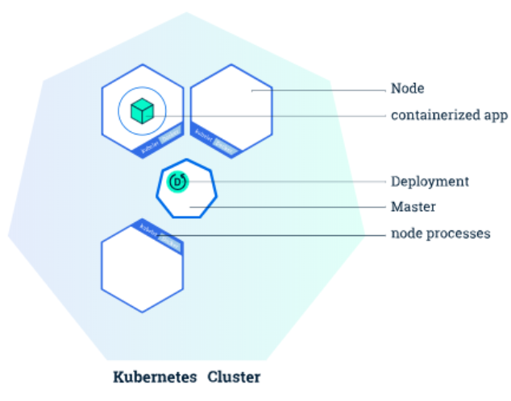

# Introduction to pods

## From container to pods



Let's see how we can deploy a simple container using kubernetes. 
To do this we need to introduce two k8s resources:

- __Pod__:
    - A pod is a collection of containers sharing a network and mount namespace and is the basic unit of deployment in Kubernetes. All containers in a pod are scheduled on the same node. 
- __Deployment__:
    - A deployment is a supervisor for pods, giving you fine-grained control over how and when a new pod version is rolled out as well as rolled back to a previous state.

## Before continuing

The docker images used in this demo can be found in:

- [lookup](https://github.com/DODAS-TS/HandsOn-INFN-2019/tree/master/templates/flask-app)
- [probe](https://github.com/DODAS-TS/HandsOn-INFN-2019/tree/master/templates/probe-app)


### Create a pod with kubectl

To run a pod all you need is:

```bash
kubectl run --generator=run-pod/v1  lookup-pod --image=dciangot/lookup --port=80
```

If everything went well you can then see your pod running after a while:

```bash
 kubectl get pods
```
```text
NAME                      READY     STATUS    RESTARTS   AGE
lookup-pod    1/1       Running   0          1m
```

### Inspect resources
Every k8s resource can be inspected with the command `describe`. This will provide you with a variety of useful information on the state and cofiguration of the resource. For instance you can get the internal pod network IP of the running container in the pod.

```bash
kubectl describe pod lookup-pod | grep IP:
IP:                     172.17.0.3
```

### Delete 

Delete the two pods and pay attention to what happens.

``` bash
kubectl delete pod lookup-pod
```


### Using manifest files

Any resource can also be created from a yaml or json template. 
In case of a pod you can find the configuration file in `templates/pods.yml`:

```yaml
apiVersion: v1
kind: Pod
metadata:
  name: lookup-manifest-pod
spec:
  containers:
  - name: lookup-container 
    image: dciangot/lookup
    ports:
    - containerPort: 80
    resources:
      limits:
        memory: "64Mi"
        cpu: "500m"
```

As you can see, is also possible to set limits for the resource to be reserved for the pod. 

Now the syntax for creating a resource from  a manifest file is:

```bash
kubectl create -f templates/k8s/pods.yml
```

And then take a look to the pod details using describe command:

```bash
kubectl describe pod lookup-manifest-pod
```

And finally remove the pod with:

```bash
kubectl delete lookup-manifest-pod
```

### Create a deployment from configuration file

You can find the configuration file for a deployment in `templates/deployments.yml`:

```yaml
apiVersion: apps/v1beta1
kind: Deployment
metadata:
  name: lookup-deployment
spec:
  replicas: 1
  template:
    metadata:
      labels:
        app: myapp
    spec:
      containers:
      - name: lookup-container-deployment
        image: dciangot/lookup 
        ports:
        - containerPort: 80
        env:
        - name: SIMPLE_SERVICE_VERSION
          value: "1.0"
        resources:
          limits:
            memory: "64Mi"
            cpu: "500m"
      - name: probe-container
        image: dciangot/probe
```

Here you can see the addition of the `replica` field where you can specifiy how many replicas of the same file you want.
Also the `label` metadata is important to organize the application management as we will see next on the k8s `service` section.

```bash
kubectl create -f templates/k8s/deployments.yml
```

Also, let's try to see the environment variable set inside the container with the `kubectl exec`utility.

First of all take and note the pod name:

```bash
kubectl get pod -l app=myapp
```
```text
NAME                                    READY   STATUS    RESTARTS   AGE
lookup-deployment-77d5748999-tcbhj   2/2     Running   0          4m11s
```

Then execute `env` command inside the container with:

```bash
kubectl exec -ti lookup-deployment-77d5748999-tcbhj  env -c lookup-container-deployment | grep SIMPLE_SERVICE_VERSION
```

We can also get to the endpoint from the probe contianer directly on localhost with:

```bash
$ kubectl exec -ti  lookup-deployment-85b549f8b6-4lgls -c probe-container curl localhost
<h3>Hello World!</h3><b>Hostname:</b> lookup-deployment-85b549f8b6-4lgls<br/>
```
 

### Update a pod

Try to modify the manifest and then run:

```bash
kubectl apply -f templates/deployments.yml
```

### Delete a pod inside a deployment

If you try to remove the pod under the deployment control, what happens?

### Before continuing: can I connect outside the pod?

Let's finally create another probe container outside the pod:

```bash
kubectl run --generator=run-pod/v1  probe-cluster-pod --image=dciangot/probe
```

Run curl in the container and check that indeed you can access the endpoint of the pods at:

```bash
$ kubectl describe pod lookup-deployment-85b549f8b6-4lgls | grep IP:
IP:                 10.244.3.6
```

```bash
$ kubectl exec -ti  probe-cluster-pod  curl 10.244.3.6
<h3>Hello World!</h3><b>Hostname:</b> lookup-deployment-85b549f8b6-4lgls<br/>
```