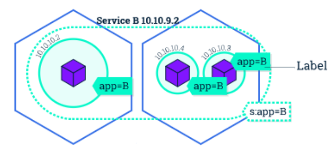

# Exposing applications in pod

We can create a reliable way to access the enpoint inside a pod using the `service` k8s resource:

- A service is an abstraction for pods, providing a stable, so called virtual IP (VIP) address. While __pods may come and go and with it their IP addresses, a service allows clients to reliably connect to the containers running in the pod using the VIP__. 
    - The virtual in VIP means it is not an actual IP address connected to a network interface, but its purpose is purely to __forward traffic to one or more pods.__
    - Keeping the mapping between the VIP and the pods up-to-date is the job of __kube-proxy, a process that runs on every node,__ which queries the API server to learn about new services in the cluster.




## Type of services

- __ClusterIP__:
  - Exposes the Service on a cluster-internal IP. Choosing this value makes the Service only reachable from within the cluster. This is the default ServiceType.
- __NodePort__:
  - Exposes the Service on each Node’s IP at a static port (the NodePort). A ClusterIP Service, to which the NodePort Service routes, is automatically created. You’ll be able to contact the NodePort Service, from outside the cluster, by requesting <NodeIP>:<NodePort>.
- __LoadBalancer__:
  - Exposes the Service externally using a cloud provider’s load balancer. NodePort and ClusterIP Services, to which the external load balancer routes, are automatically created.
- __ExternalName/IPs__: Maps the Service to the contents of the externalName/IPs field (e.g. foo.bar.example.com)


## Create a service

Now let's take a look to the yml file for creating a service `templates/services.yml`:

```yaml
apiVersion: v1
kind: Service
metadata:
  name: simpleservice
spec:
  ports:
    - port: 300<youID>
      targetPort: 80
  selector:
    app: myapp
```

To create a service execute:

```bash
kubectl create -f templates/services.yml
```

### Get the cluster IP

```bash
$ kubectl get svc  simpleservice
NAME            TYPE        CLUSTER-IP     EXTERNAL-IP      PORT(S)     AGE
simpleservice   ClusterIP   10.99.69.211   <None>   30102/TCP   11m
```

### Checking connectivity with the cluster probe pod

Log into the 

```bash
$ kubectl exec -ti  probe-cluster-pod  curl 10.99.69.211:30102
<h3>Hello World!</h3><b>Hostname:</b> lookup-deployment-85b549f8b6-4lgls<br/>
```

### Scale

Let's scale the lookup-deployment up:

```bash
kubectl scale deployment lookup-deployment --replicas 3
```

```bash
$ kubectl get deployment
NAME                READY   UP-TO-DATE   AVAILABLE   AGE
lookup-deployment   3/3     3            3           16m
```

```bash
$ kubectl get pod       
NAME                                 READY   STATUS    RESTARTS   AGE
lookup-deployment-85b549f8b6-4lgls   2/2     Running   0          14m
lookup-deployment-85b549f8b6-6w4qq   2/2     Running   0          98s
lookup-deployment-85b549f8b6-rhf82   2/2     Running   0          98s
probe-cluster-pod                    1/1     Running   0          9m3s
```

Check the effect of the load-balancing introduced by Kubernetes:

```bash
$ kubectl exec -ti  probe-cluster-pod  curl 10.99.69.211:300<youID>
<h3>Hello World!</h3><b>Hostname:</b> lookup-deployment-85b549f8b6-4lgls<br/>

$ kubectl exec -ti  probe-cluster-pod  curl 10.99.69.211:300<youID>
<h3>Hello World!</h3><b>Hostname:</b> lookup-deployment-85b549f8b6-rhf82<br/>

kubectl exec -ti  probe-cluster-pod  curl 10.99.69.211:300<youID>
<h3>Hello World!</h3><b>Hostname:</b> lookup-deployment-85b549f8b6-6w4qq<br/>
```

## Extras


### External IPs


```yaml
apiVersion: v1
kind: Service
metadata:
  name: simpleservice
spec:
  ports:
    - port: 300<youID>
      targetPort: 80
  externalIPs:
    - 10.2.201.117
  selector:
    app: myapp
```

```bash
curl 10.2.201.117:300<youID>
```

### Ingress Controllers

[REF]
