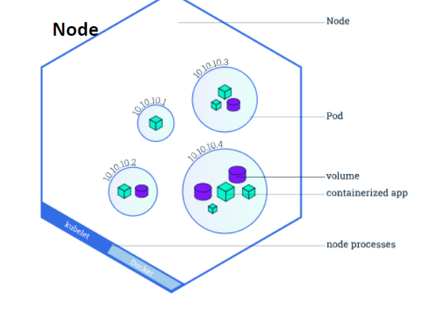

# Using Kubernetes volumes

## Why?
As we have already seen, on-disk files within a container are
ephemeral. This presents some problems for non-trivial applications
when running in containers.
- When a Container crashes, kubelet will restart it, but the internal container
files will be lost - the Container starts with a clean state.
- When running Containers together in a Pod it is often necessary to share files
between those Containers.
- The Kubernetes Volume abstraction solves both of these problems.



## Volumes

A Kubernetes volume is essentially a directory accessible to all containers running in a pod. In contrast to the container-local filesystem, the data in volumes is preserved across container restarts. The medium backing a volume and its contents are determined by the volume type:

- node-local types such as `emptyDir` or `hostPath`
- file-sharing types such as `nfs`
- cloud provider-specific types like `awsElasticBlockStore`, `azureDisk`, or `gcePersistentDisk`
- distributed file system types, for example `glusterfs` or `cephfs`
special-purpose types like `secret`, `gitRepo`
- a special type of volume called `PersistentVolume`, see [HERE]

### Create a node-local volume with emptyDir

```bash
$ kubectl apply -f https://raw.githubusercontent.com/openshift-evangelists/kbe/master/specs/volumes/pod.yaml

$ kubectl describe pod sharevol
Name:                   sharevol
Namespace:              default
...
Volumes:
  xchange:
    Type:       EmptyDir (a temporary directory that shares a pod's lifetime)
    Medium:
```

```bash
$ kubectl exec -it sharevol -c c1 -- bash
[root@sharevol /]# mount | grep xchange
/dev/sda1 on /tmp/xchange type ext4 (rw,relatime,data=ordered)
[root@sharevol /]# echo 'some data' > /tmp/xchange/data
```

```bash
$ kubectl exec -it sharevol -c c2 -- bash
[root@sharevol /]# mount | grep /tmp/data
/dev/sda1 on /tmp/data type ext4 (rw,relatime,data=ordered)
[root@sharevol /]# cat /tmp/data/data
some data
```

### Share a secret across pods

```bash
$ echo -n "A19fh68B001j" > ./apikey.txt

$ kubectl create secret generic apikey --from-file=./apikey.txt
secret "apikey" created

$ kubectl describe secrets/apikey
Name:           apikey
Namespace:      default
Labels:         <none>
Annotations:    <none>

Type:   Opaque

Data
====
apikey.txt:     12 bytes
```

```bash
kubectl apply -f https://raw.githubusercontent.com/openshift-evangelists/kbe/master/specs/secrets/pod.yaml
```

```bash
$ kubectl exec -it consumesec -c shell -- bash
[root@consumesec /]# mount | grep apikey
tmpfs on /tmp/apikey type tmpfs (ro,relatime)
[root@consumesec /]# cat /tmp/apikey/apikey.txt
A19fh68B001j
```